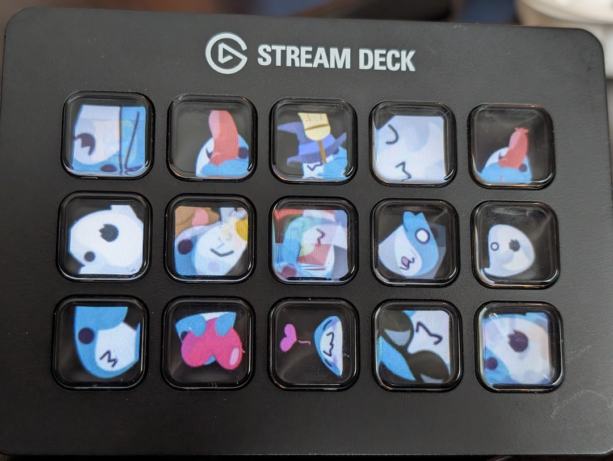

# Teensy USBHost Streamdeck

This is an add-on library for supporting the Stream Deck V2, MkII, and (probably) XL on the Teensy 4.x with the included (no need to install) [USBHost_t36](https://github.com/PaulStoffregen/USBHost_t36/) core library.

## USBHost Usage:

There are two hook points you can add your own callbacks for:
* Single key press/release hook - `void attachSinglePress(void (*f)(StreamdeckController *sdc, const uint16_t keyIndex, const uint8_t newValue, const uint8_t oldValue))`
* Press/release hook showing all key states at once - `void attachAnyChange(void (*f)(StreamdeckController *sdc, const uint8_t *newStates, const uint8_t *oldStates))`

There are a handful of useful functions you can call from your script when the controller is attached/active:
* `void setBrightness(float percent)` - sets brightness; percent values are floats between 0 and 1
* `void setKeyImage(const uint16_t keyIndex, const uint8_t *image, const uint16_t length)` - lets you set a jpeg-formatted image to a key
* `void setKeyBlank(const uint16_t keyIndex)` - sets a key to black
* `uint16_t getNumKeys()` - retrieves the number of keys/states available
* `void reset()` - issues a reset! Don't do this for now; it irrevocably resets the pipes
* `void flushImageReports()` - clears the pending queue and sends an empty outbound report to reset counters on the Streamdeck [this also isn't working right, but I haven't found a need for it].
* `void blankAllKeys();` - shortcut to set all keys to blank (black)

## Image Helper Usage:

Yes, I now have an image helper inclusion that's based on the outstanding [tgx](https://github.com/vindar/tgx), [JPEGENC](https://github.com/bitbank2/JPEGENC), and [JPEGDEC](https://github.com/bitbank2/JPEGDEC) libraries. It's included and enabled by default though it can be disabled with build options in PlatformIO or by changing `streamdeck_config.hpp` in Arduino libraries.

Check out the `RandomBlobhaj` example for the simplest path to using the Image Helper. Basic order of operations:

1. Create a new ``Streamdeck::Image`` object, passing it in the settings fetched from your StreamdeckController instance.
2. On that new image object, `.importJpeg` to import from memory, a filename, or a file handle.
3. Perform any transformation operations needed on that image object. Memory will be dynamically allocated and released as needed.
4. Use the `.sendToKey` shortcut to send it to your StreamdeckController instance.

Et voila!

## Todo:

* Add support for other Stream Decks, ideally mirroring [python-elgato-streamdeck](https://github.com/abcminiuser/python-elgato-streamdeck/)'s support.
* Add support or optional addon for image manipulation (scaling, flip/rotation)
* Add more examples